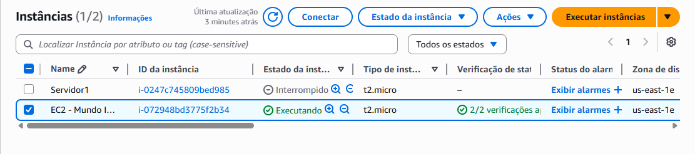
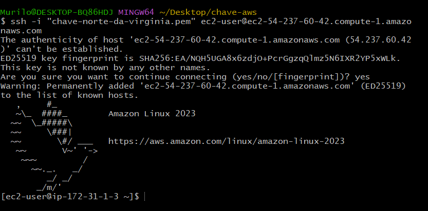
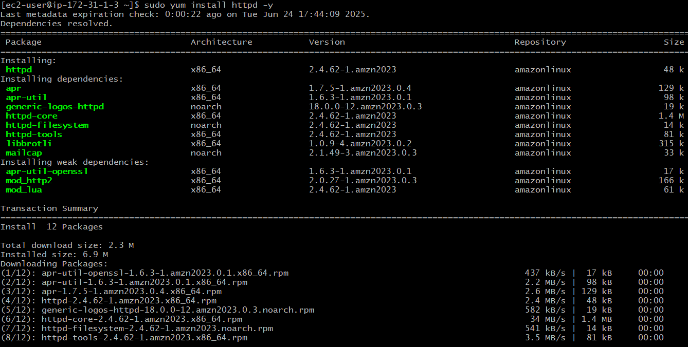
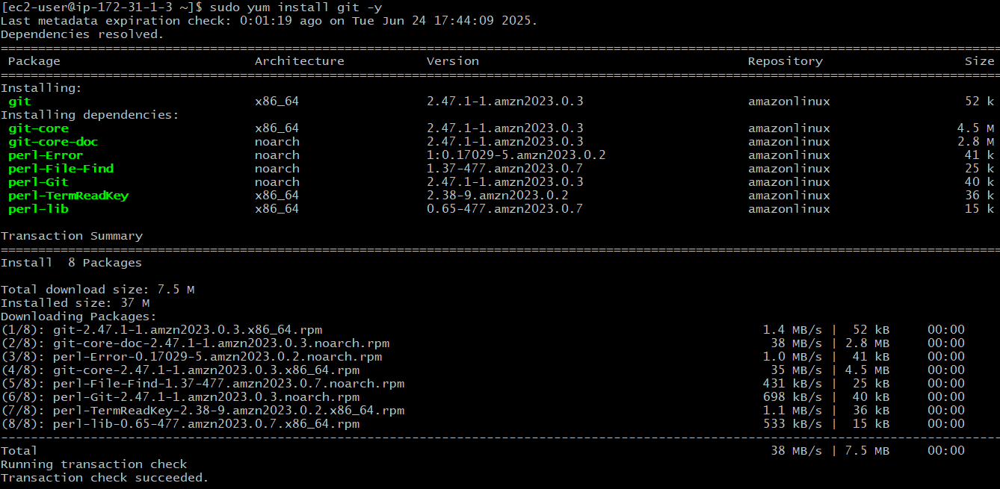

# 🚀 Deploy de Site no Amazon EC2 com Apache

Projeto demonstrativo de como realizar o deploy de um site estático hospedado em uma instância EC2 utilizando o sistema **Amazon Linux 2023**, com instalação do servidor **Apache (httpd)** e do **Git** para versionamento.

---

## ☁️ Etapas Realizadas

### ✅ 1. Criação da Instância EC2

A instância foi criada na AWS com Amazon Linux 2023 e configurada com acesso via chave `.pem`.



---

### 🔐 2. Acesso via SSH

Foi realizado o acesso remoto à instância utilizando SSH.

```bash
ssh -i "chave-norte-da-virginia.pem" ec2-user@<ENDEREÇO-PÚBLICO>
```



---

### 🌐 3. Instalação do Servidor Apache (httpd)

O Apache foi instalado para servir as páginas web.

```bash
sudo yum install httpd -y
```



---

### 🧰 4. Instalação do Git

Também foi instalado o Git para clonar o repositório do projeto diretamente na instância.

```bash
sudo yum install git -y
```



---

### 📁 5. Deploy do Projeto

Após instalação, o repositório contendo os arquivos HTML/CSS foi clonado no diretório raiz do Apache (`/var/www/html`) substituindo a página padrão.

---

### 🌍 6. Site no Ar!

Com tudo configurado, o site está acessível pelo endereço público da instância:


---

## 🛠️ Tecnologias Utilizadas

- Amazon EC2 (Amazon Linux 2023)
- Apache HTTP Server
- Git
- SSH
- HTML/CSS

---

## 📌 Observações

- Certifique-se de abrir a porta **80** no grupo de segurança da instância EC2 para permitir acesso HTTP.
- O diretório `/var/www/html` é o caminho padrão para arquivos web no Apache.

---

## 📎 Autor

Murilo Carnelós  
💼 [LinkedIn](https://www.linkedin.com/in/murilo-carnelos)
